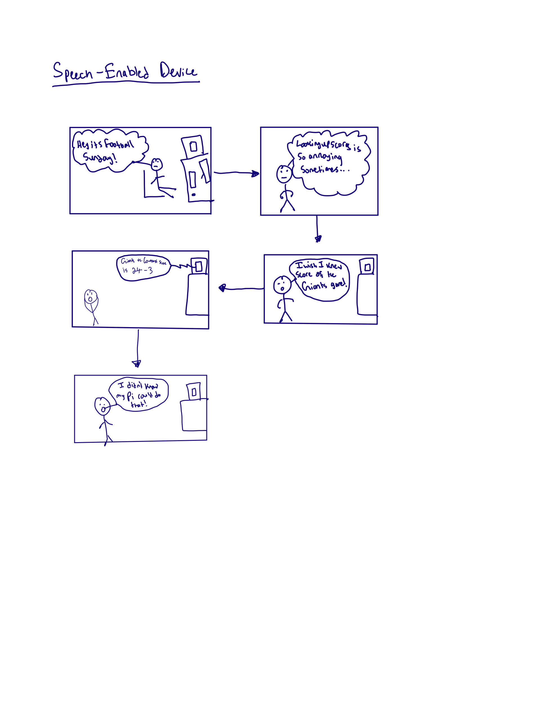
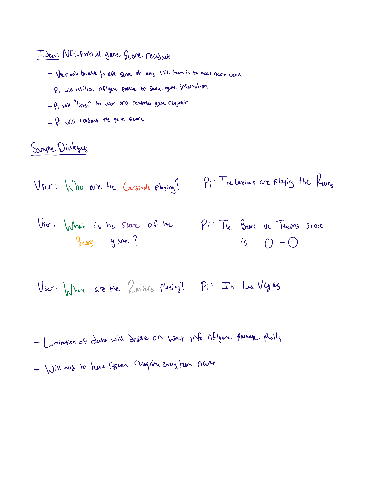
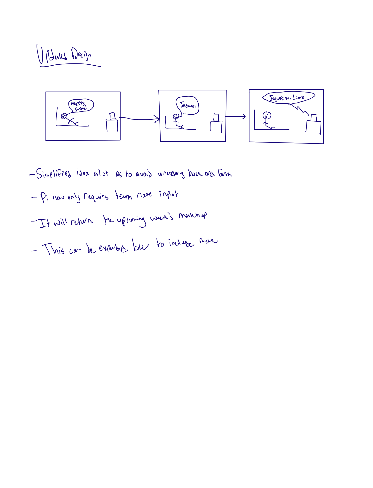

# Chatterboxes
**NAMES OF COLLABORATORS HERE**
[](https://www.youtube.com/embed/Q8FWzLMobx0?start=19)

In this lab, we want you to design interaction with a speech-enabled device--something that listens and talks to you. This device can do anything *but* control lights (since we already did that in Lab 1).  First, we want you first to storyboard what you imagine the conversational interaction to be like. Then, you will use wizarding techniques to elicit examples of what people might say, ask, or respond.  We then want you to use the examples collected from at least two other people to inform the redesign of the device.

We will focus on **audio** as the main modality for interaction to start; these general techniques can be extended to **video**, **haptics** or other interactive mechanisms in the second part of the Lab.

## Prep for Part 1: Get the Latest Content and Pick up Additional Parts 

### Pick up Web Camera If You Don't Have One

Students who have not already received a web camera will receive their [IMISES web cameras](https://www.amazon.com/Microphone-Speaker-Balance-Conference-Streaming/dp/B0B7B7SYSY/ref=sr_1_3?keywords=webcam%2Bwith%2Bmicrophone%2Band%2Bspeaker&qid=1663090960&s=electronics&sprefix=webcam%2Bwith%2Bmicrophone%2Band%2Bsp%2Celectronics%2C123&sr=1-3&th=1) on Thursday at the beginning of lab. If you cannot make it to class on Thursday, please contact the TAs to ensure you get your web camera. 

### Get the Latest Content

As always, pull updates from the class Interactive-Lab-Hub to both your Pi and your own GitHub repo. There are 2 ways you can do so:

**\[recommended\]**Option 1: On the Pi, `cd` to your `Interactive-Lab-Hub`, pull the updates from upstream (class lab-hub) and push the updates back to your own GitHub repo. You will need the *personal access token* for this.

```
pi@ixe00:~$ cd Interactive-Lab-Hub
pi@ixe00:~/Interactive-Lab-Hub $ git pull upstream Fall2022
pi@ixe00:~/Interactive-Lab-Hub $ git add .
pi@ixe00:~/Interactive-Lab-Hub $ git commit -m "get lab3 updates"
pi@ixe00:~/Interactive-Lab-Hub $ git push
```

Option 2: On your your own GitHub repo, [create pull request](https://github.com/FAR-Lab/Developing-and-Designing-Interactive-Devices/blob/2022Fall/readings/Submitting%20Labs.md) to get updates from the class Interactive-Lab-Hub. After you have latest updates online, go on your Pi, `cd` to your `Interactive-Lab-Hub` and use `git pull` to get updates from your own GitHub repo.

## Part 1.

### Text to Speech 

In this part of lab, we are going to start peeking into the world of audio on your Pi! 

We will be using the microphone and speaker on your webcamera. In the home directory of your Pi, there is a folder called `text2speech` containing several shell scripts. `cd` to the folder and list out all the files by `ls`:

```
pi@ixe00:~/text2speech $ ls
Download        festival_demo.sh  GoogleTTS_demo.sh  pico2text_demo.sh
espeak_demo.sh  flite_demo.sh     lookdave.wav
```

You can run these shell files by typing `./filename`, for example, typing `./espeak_demo.sh` and see what happens. Take some time to look at each script and see how it works. You can see a script by typing `cat filename`. For instance:

```
pi@ixe00:~/text2speech $ cat festival_demo.sh 
#from: https://elinux.org/RPi_Text_to_Speech_(Speech_Synthesis)#Festival_Text_to_Speech

echo "Just what do you think you're doing, Dave?" | festival --tts
```

Now, you might wonder what exactly is a `.sh` file? Typically, a `.sh` file is a shell script which you can execute in a terminal. The example files we offer here are for you to figure out the ways to play with audio on your Pi!

You can also play audio files directly with `aplay filename`. Try typing `aplay lookdave.wav`.

\*\***Write your own shell file to use your favorite of these TTS engines to have your Pi greet you by name.**\*\*
(This shell file should be saved to your own repo for this lab.)

This custom file is located here: https://github.com/vikp6/Interactive-Lab-Hub/blob/Fall2022/Lab%203/espeak_demo.sh

Bonus: If this topic is very exciting to you, you can try out this new TTS system we recently learned about: https://github.com/rhasspy/larynx

### Speech to Text

Now examine the `speech2text` folder. We are using a speech recognition engine, [Vosk](https://alphacephei.com/vosk/), which is made by researchers at Carnegie Mellon University. Vosk is amazing because it is an offline speech recognition engine; that is, all the processing for the speech recognition is happening onboard the Raspberry Pi. 

In particular, look at `test_words.py` and make sure you understand how the vocab is defined. 
Now, we need to find out where your webcam's audio device is connected to the Pi. Use `arecord -l` to get the card and device number:
```
pi@ixe00:~/speech2text $ arecord -l
**** List of CAPTURE Hardware Devices ****
card 1: Device [Usb Audio Device], device 0: USB Audio [USB Audio]
  Subdevices: 1/1
  Subdevice #0: subdevice #0
```
The example above shows a scenario where the audio device is at card 1, device 0. Now, use `nano vosk_demo_mic.sh` and change the `hw` parameter. In the case as shown above, change it to `hw:1,0`, which stands for card 1, device 0.  

Now, look at which camera you have. Do you have the cylinder camera (likely the case if you received it when we first handed out kits), change the `-r 16000` parameter to `-r 44100`. If you have the IMISES camera, check if your rate parameter says `-r 16000`. Save the file using Write Out and press enter.

Then try `./vosk_demo_mic.sh`

\*\***Write your own shell file that verbally asks for a numerical based input (such as a phone number, zipcode, number of pets, etc) and records the answer the respondent provides.**\*\*

This custom file is located here: https://github.com/vikp6/Interactive-Lab-Hub/blob/Fall2022/Lab%203/speech2text/zipcode_ask.sh

### Serving Pages

In Lab 1, we served a webpage with flask. In this lab, you may find it useful to serve a webpage for the controller on a remote device. Here is a simple example of a webserver.

```
pi@ixe00:~/Interactive-Lab-Hub/Lab 3 $ python server.py
 * Serving Flask app "server" (lazy loading)
 * Environment: production
   WARNING: This is a development server. Do not use it in a production deployment.
   Use a production WSGI server instead.
 * Debug mode: on
 * Running on http://0.0.0.0:5000/ (Press CTRL+C to quit)
 * Restarting with stat
 * Debugger is active!
 * Debugger PIN: 162-573-883
```
From a remote browser on the same network, check to make sure your webserver is working by going to `http://<YourPiIPAddress>:5000`. You should be able to see "Hello World" on the webpage.

### Storyboard

Storyboard and/or use a Verplank diagram to design a speech-enabled device. (Stuck? Make a device that talks for dogs. If that is too stupid, find an application that is better than that.) 

\*\***Post your storyboard and diagram here.**\*\*


Write out what you imagine the dialogue to be. Use cards, post-its, or whatever method helps you develop alternatives or group responses. 

\*\***Please describe and document your process.**\*\*


### Acting out the dialogue

Find a partner, and *without sharing the script with your partner* try out the dialogue you've designed, where you (as the device designer) act as the device you are designing.  Please record this interaction (for example, using Zoom's record feature).

\*\***Describe if the dialogue seemed different than what you imagined when it was acted out, and how.**\*\*
Video Link: https://drive.google.com/file/d/1xO-nT95MxnJ1vAJUaSs3BFBpxwX-ZGYg/view?usp=sharing

The dialogue went the way I expected. I think the "computer's" response was actually quite verbose so might adjust that for Part 2.

### Wizarding with the Pi (optional)
In the [demo directory](./demo), you will find an example Wizard of Oz project. In that project, you can see how audio and sensor data is streamed from the Pi to a wizard controller that runs in the browser.  You may use this demo code as a template. By running the `app.py` script, you can see how audio and sensor data (Adafruit MPU-6050 6-DoF Accel and Gyro Sensor) is streamed from the Pi to a wizard controller that runs in the browser `http://<YouPiIPAddress>:5000`. You can control what the system says from the controller as well!

\*\***Describe if the dialogue seemed different than what you imagined, or when acted out, when it was wizarded, and how.**\*\*

# Lab 3 Part 2

For Part 2, you will redesign the interaction with the speech-enabled device using the data collected, as well as feedback from part 1.

## Prep for Part 2

1. What are concrete things that could use improvement in the design of your device? For example: wording, timing, anticipation of misunderstandings...

The most important improvement is reducing the verbage that the device will need to listen to. I've realized that the voice to text functionality is quite finnicky so I am reducing the interaction to having the user just say the NFL team name.

2. What are other modes of interaction _beyond speech_ that you might also use to clarify how to interact?

Although I did not have time to implement it this time, including a joystick to manually select a team via the display would be useful. This is especially useful if the device is unable to register what team is being said by the user.

3. Make a new storyboard, diagram and/or script based on these reflections.



## Prototype your system

The system should:
* use the Raspberry Pi 
* use one or more sensors
* require participants to speak to it. 

*Document how the system works*

*Include videos or screencaptures of both the system and the controller.*

Video of how it works:
https://drive.google.com/file/d/1Xbl69BFJ_A5HQFOLLwYVHEymPRgvt7Sh/view?usp=sharing

## Test the system
Try to get at least two people to interact with your system. (Ideally, you would inform them that there is a wizard _after_ the interaction, but we recognize that can be hard.)

Answer the following:

### What worked well about the system and what didn't?

The main issue I ran into was involving the nflgame python package that I was planning to use. As I was setting it up, I found out the package is quite old and it had very minimal documentation. I kept running into an error that I tried debugging for a while but decided to switch gears. My next idea was to gather the NFL weekly data that I wanted by myself. Luckily I found a plain text webpage that held information for each week's games. Using the requests package I was able to access this site and scrape through to find the exact information I needed. Once this was implemented I was successfully able to grab the team matchup data and it started working quite well.

What unfortunately isn't working so well is the text to speech as the mic seems to not consistently pickup the team names I want. Sometimes it works and sometimes it doesn't.

### What worked well about the controller and what didn't?

Unfortunately I wasn't able to implement a controller specific to my design. I think the controller worked well for the accelerometer setup but I don't think it would be very useful for my NFL matchup retrieval program. I was really going for a design that was extremely simple and the user only had to speak to get a response. I understand though that having to start the program in terminal is not ideal so here is definitely where I would want to improve my design.

### What lessons can you take away from the WoZ interactions for designing a more autonomous version of the system?

I think the WoZ automation of sensing the accelerometer highlights a good usage of perpetual data collection. Again, I'm not quite sure how to apply that to my idea. Maybe I could find a way to have my setup continuously seek verbal input and will provide even more information. Similar to that of Alexa, I think my device would be able to stay turned on long term and return any NFL weekly stats from the present as well as the past. I would need to do a bit more work on the controller end to implement this.


### How could you use your system to create a dataset of interaction? What other sensing modalities would make sense to capture?

I could in theory save every recording of the speech input. This could create a very rich dataset of differing voices calling out team names. In theory this could be used to optimize the voice recognition algorithm. The only other sensing modality I can think of is either gesture or touch. Any buttons would help the user to dig a bit deeper into the stats of each NFL game.

